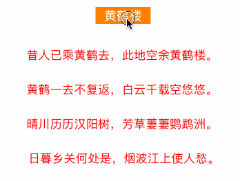

## ZZStringAnimation
*  String animation for UILabel text.
*  It is currently in the development.
*  Welcome to fork and submit pull requests.

	

## Contents

* Currently contains these animations

	* **ZZLightAnimation**
	* **ZZEnlargeAnimation**
	* **ZZDrawAnimation**
	* **ZZGradualAnimation**
	* **ZZWaveAnimation**
	* **ZZPathAnimation**
* These animations in development
	* **ZZArcAnimation**

## Installation

### Manual

All you need to do is drop ZZStringAnimation folder into your project

## Example usage
    
* **EnlargeAnimation**

	```objc
	ZZEnlargeAnimation *enlargeAnimation = [ZZEnlargeAnimation new];
    enlargeAnimation.duration = 5;
    enlargeAnimation.enlargeMultiple = 3;
    [self.label zz_startAnimation:enlargeAnimation];
    ```
* **DrawAnimation**

	```objc
	ZZDrawAnimation *drawAnimation = [ZZDrawAnimation new];
    drawAnimation.duration = 5;
    [self.label zz_startAnimation:drawAnimation];
    ```
* **GradualAnimation**

	```objc
	ZZGradualAnimation *gradualAnimation = [ZZGradualAnimation new];
    gradualAnimation.duration = 5;
    [self.label zz_startAnimation:gradualAnimation];
    ```
* **ZZWaveAnimation**

	```objc
	ZZWaveAnimation *waveAnimation = [ZZWaveAnimation new];
    waveAnimation.duration = 5;
    [self.label zz_startAnimation:waveAnimation];
    ```

## Contact

zmarvin

* [https://github.com/zmarvin](https://github.com/zmarvin)
* [http://blog.csdn.net/theroadofprogrammers](http://blog.csdn.net/theroadofprogrammers)
* [http://www.zmarvin.com/](http://www.zmarvin.com/)
* [seeforward@zmarvin.com](mailto:seeforward@zmarvin.com)

## License

The MIT License (MIT)

Copyright (c) 2017 zmarvin

Permission is hereby granted, free of charge, to any person obtaining a copy
of this software and associated documentation files (the "Software"), to deal
in the Software without restriction, including without limitation the rights
to use, copy, modify, merge, publish, distribute, sublicense, and/or sell
copies of the Software, and to permit persons to whom the Software is
furnished to do so, subject to the following conditions:

The above copyright notice and this permission notice shall be included in all
copies or substantial portions of the Software.

THE SOFTWARE IS PROVIDED "AS IS", WITHOUT WARRANTY OF ANY KIND, EXPRESS OR
IMPLIED, INCLUDING BUT NOT LIMITED TO THE WARRANTIES OF MERCHANTABILITY,
FITNESS FOR A PARTICULAR PURPOSE AND NONINFRINGEMENT. IN NO EVENT SHALL THE
AUTHORS OR COPYRIGHT HOLDERS BE LIABLE FOR ANY CLAIM, DAMAGES OR OTHER
LIABILITY, WHETHER IN AN ACTION OF CONTRACT, TORT OR OTHERWISE, ARISING FROM,
OUT OF OR IN CONNECTION WITH THE SOFTWARE OR THE USE OR OTHER DEALINGS IN THE
SOFTWARE.