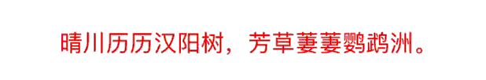
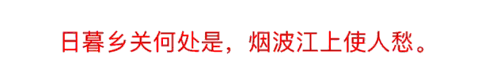
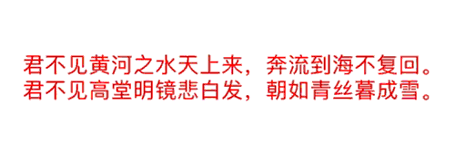
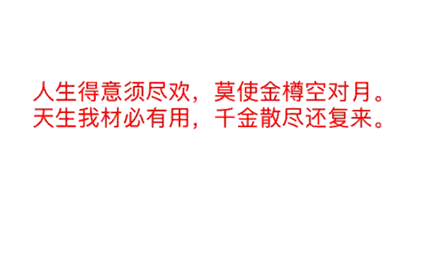

## ZZStringAnimation
*  String animation for UILabel text.


## Contents

* Currently contains these animations

	* **ZZDrawAnimation**
	* **ZZGradualAnimation**
	* **ZZWaveAnimation**
	* **ZZPathAnimation**


## Example usage

* **ZZDrawAnimation**

	 

	```objc
	ZZDrawAnimation *drawAnimation = [ZZDrawAnimation new];
    drawAnimation.duration = 5;
    [self.label zz_startAnimation:drawAnimation];
    ```
* **ZZGradualAnimation**

	

	```objc
	ZZGradualAnimation *gradualAnimation = [ZZGradualAnimation new];
    gradualAnimation.duration = 5;
    [self.label zz_startAnimation:gradualAnimation];
    ```
* **ZZWaveAnimation**

	

	```objc
	ZZWaveAnimation *waveAnimation = [ZZWaveAnimation new];
    waveAnimation.duration = 5;
    [self.label zz_startAnimation:waveAnimation];
    ```
* **ZZPathAnimation**

	

	```objc
	ZZPathAnimation *pathAnimation = [ZZPathAnimation new];
    pathAnimation.duration = 5;
    pathAnimation.path = [UIBezierPath bezierPathWithOvalInRect:CGRectMake(25, 400, 300, 150)];
    [self.label zz_startAnimation:pathAnimation];
    ```

